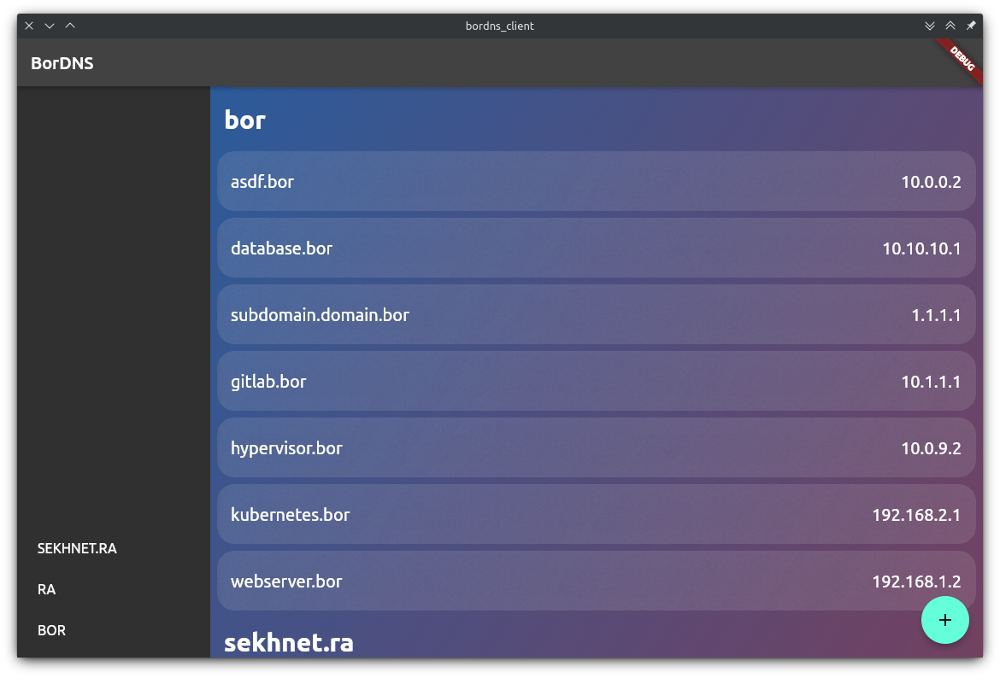
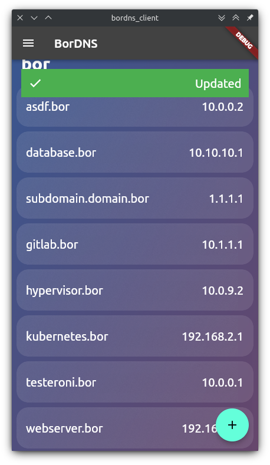
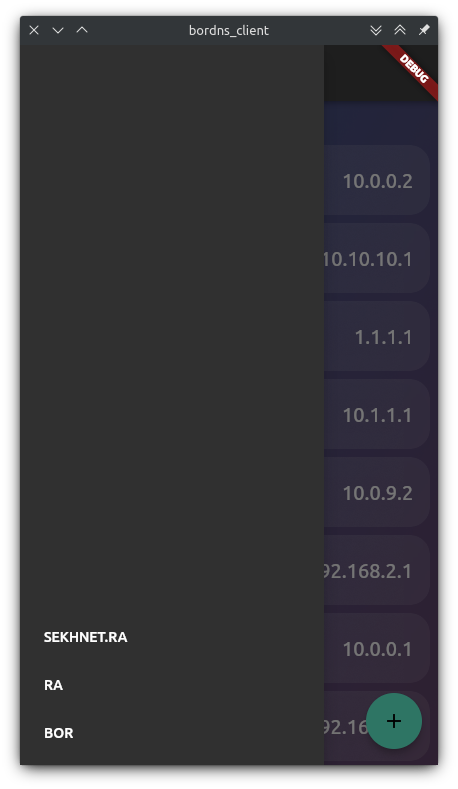
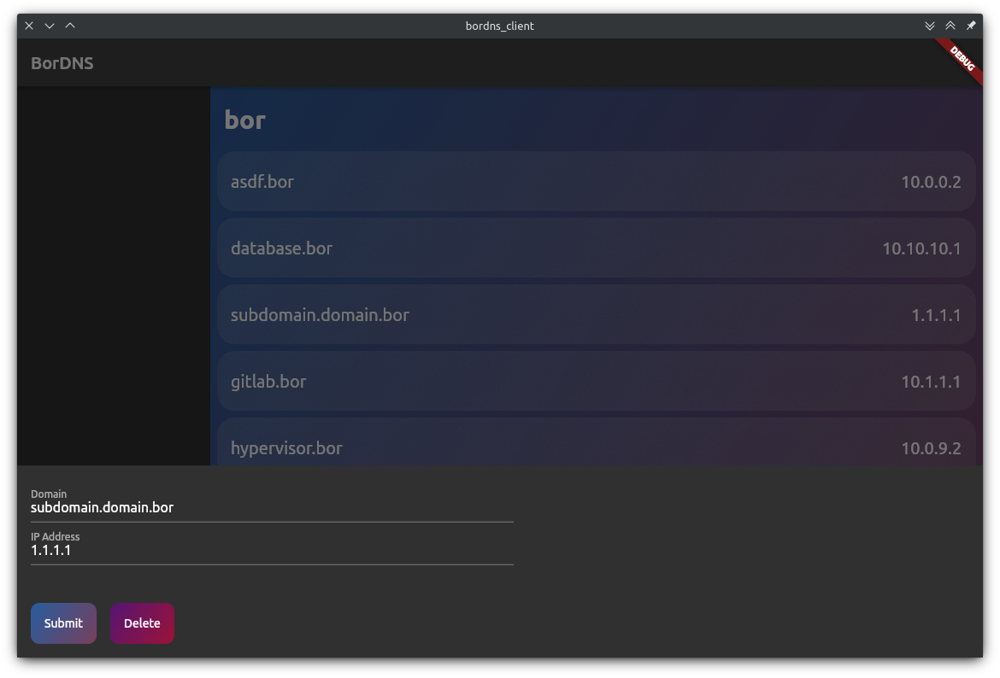
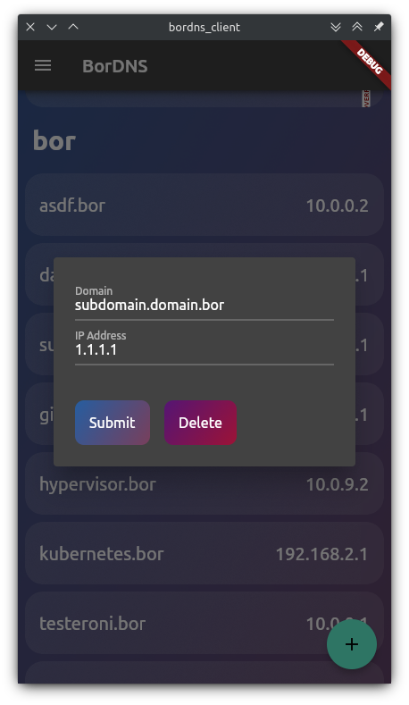
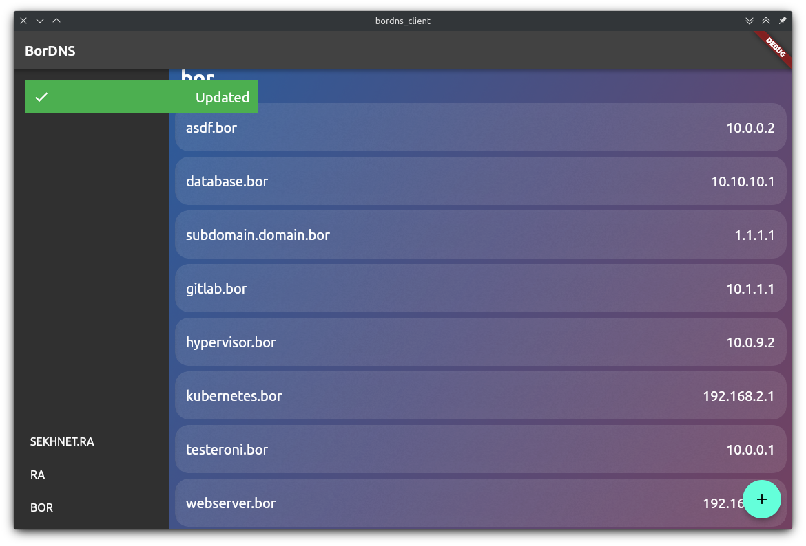
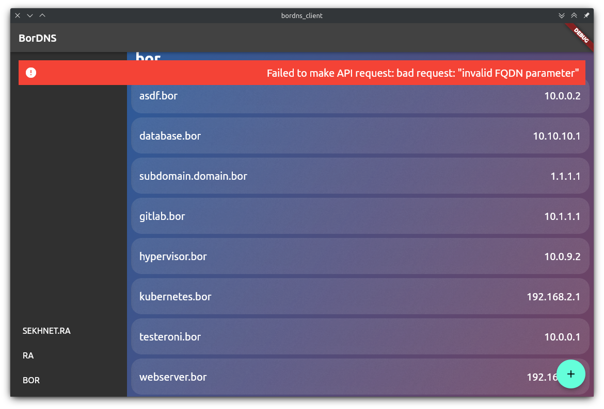

# bordns_client

For CRUD operations on DNS names.

The purpose of this project was to create a series of classes
to allow the software to run on mobile and desktop while also
having the layout make sense.

The ultimate goal here is to rebuild the client for  
[Budget Client](https://github.com/fargusplumdoodle/sekhnet-budget-client).

I made all of the assets for this project in GIMP.

# UI screenshots

**Main page:**
The menu is on the side of the page in desktop and its in the drawer
on mobile.

**Edit screens:**

**Updated and error screens:**
The fun part about this is there is a library I use to make
them bounce onto the screen, and then they disapear after 5 seconds.

